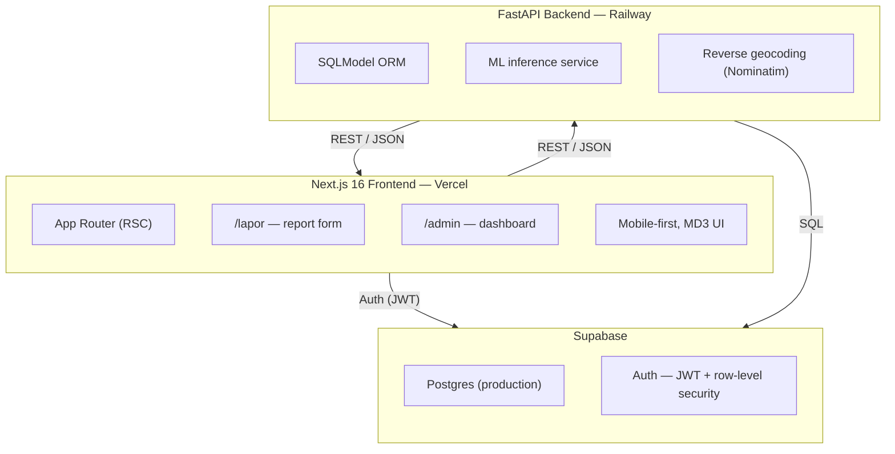

<div align="center">

# Awas-Jentik

### Early-warning malaria surveillance for Indonesia's re-establishment risk zones

[](https://nextjs.org/)
[](https://fastapi.tiangolo.com/)
[](https://react.dev/)
[](https://supabase.com/)
[](https://scikit-learn.org/)
[]()
[]()

**[Live Demo](https://malaria-watch.vercel.app/)** · **[Report Bug](https://github.com/FathanARY/Awas-Jentik/issues)** · **[Request Feature](https://github.com/FathanARY/Awas-Jentik/issues)**

</div>

---

> A note on scope before you read further: this README documents a 30-hour hackathon build (GarudaHacks 7.0, Health Track), not a production system. Every section below states clearly what is implemented, what is partially implemented, and what is planned. See [Development Status](#development-status) for the honest breakdown.

---

## Table of Contents

1. [What Awas-Jentik Does](#what-awas-jentik-does)
2. [System Architecture](#system-architecture)
3. [Quick Start](#quick-start)
4. [API Reference](#api-reference)
5. [Testing & Quality](#testing--quality)
6. [Platform Capabilities](#platform-capabilities)
7. [Tech Stack](#tech-stack)
8. [Repository Navigation](#repository-navigation)
9. [Roadmap](#roadmap)
10. [Development Status](#development-status)
11. [Contributing, License & Contact](#contributing-license--contact)

---

## What Awas-Jentik Does

Indonesia recorded 706,297 malaria cases in 2025, up 30% from the year before, with 95% concentrated in Papua. 412 of 514 regencies are certified malaria-free, but some are experiencing re-establishment outbreaks. The official reporting system, SISMAL, activates only after a patient is diagnosed, by which point the breeding site has been active for weeks.

Awas-Jentik is a two-layer early-warning system that scores malaria risk **before** the first case appears, combining environmental breeding-site data with human mobility data.

### Core features (implemented)

- **Field reporting in under 2 minutes** — habitat checklist (standing water, vegetation, sunlight exposure), photo evidence, automatic GPS capture
- **Dual AI risk scoring** — two independently trained Random Forest models (habitat + mobility) combined through a transparent formula, not a single opaque model
- **Admin monitoring dashboard** — 2,500-grid risk heatmap, priority area list, aggregate statistics
- **Report verification workflow** — health officers can review and mark reports as handled
- **REST API** — 7+ endpoints covering reporting, ML inference, and dashboard aggregation

### Features designed and partially built (see [Development Status](#development-status))

- CSV bulk upload with staging/preview for mobility data
- Change-detection panel (category shift tracking per grid)
- Staleness tracking (grids with no update >60 days)
- Notification system on category escalation
- Two-role auth (`user`, `admin`) via Supabase

### Value proposition

| For | Value |
|---|---|
| Community members | Report suspicious sites in under 2 minutes, get an instant risk score, no medical training required |
| Health workers (kader, puskesmas) | See exactly which areas need attention today, not after a case is confirmed |
| Dinkes / policymakers | Aggregate visibility across 2,500 grids with transparent, auditable scoring, not a black box |

---

## System Architecture
 
Awas-Jentik is a **two-service architecture** with a managed backend platform, deliberately not microservices. At hackathon scale, a monolithic frontend and a monolithic backend talking to a single managed Postgres instance is the correct architecture: it minimizes operational surface area while the core scoring loop is validated.
 


### Services

| Service | Technology | Deploy target | Responsibility |
|---|---|---|---|
| Frontend | Next.js 16 (App Router), React 19, TypeScript | Vercel | Citizen reporting UI, admin dashboard, GPS capture, map rendering |
| Backend | FastAPI (Python 3.12), SQLModel | Railway | Report ingestion, ML inference, reverse geocoding, dashboard aggregation |
| Database + Auth | Supabase (managed Postgres + Auth) | Supabase Cloud | Persistent storage, JWT-based authentication, row-level security |
| ML models | scikit-learn RandomForestRegressor (`.pkl`) | Bundled in Backend container | Habitat risk inference, mobility risk inference |

### Risk scoring architecture

The scoring engine is two independently trained models combined through a fixed, transparent formula, not a single end-to-end model:

$$\text{Risiko Gabungan} = 0.65 \times \text{Habitat Score} + 0.20 \times \text{Mobility Score} + 0.15 \times \text{Case Score}$$

| Component | Model | Input features | Validated \\( R^2 \\) |
|---|---|---|---|
| Habitat risk | RandomForestRegressor | 13 features (moss %, vegetation %, standing water, sun exposure, rainfall, 7 distance-to-landmark features) | 0.924 |
| Mobility risk | RandomForestRegressor | 4 features (30-day migrant count, migrants from endemic areas, mobile workers, travel history) | 0.639 |
| Case score | Direct formula (not ML) | `clip(16 × confirmed_cases_1km_30d, 0, 100)` | n/a |
| Combined pipeline | Weighted formula | All three components above | **0.927** (end-to-end validation) |

The habitat-mobility correlation in our training data is 0.006, near zero, which is why these are two separate models rather than one combined model. Combining them into a single model measurably hurt accuracy during development.

---

## Quick Start

### Prerequisites

| Tool | Version | Required for |
|---|---|---|
| Node.js | 20+ | Frontend |
| npm | 10+ | Frontend package management |
| Python | 3.12+ | Backend, ML pipeline |
| pip | latest | Backend dependencies |
| Docker + Docker Compose | latest | Optional, unified local dev |
| Supabase account | free tier | Auth + Postgres (or use local SQLite for dev) |

### Option A — Docker Compose (recommended, runs both services)

```bash
git clone https://github.com/FathanARY/Awas-Jentik.git
cd Awas-Jentik

# Copy environment templates and fill in your values
cp BE/.env.example BE/.env
cp FE/.env.example FE/.env.local

docker compose up -d

# Frontend: http://localhost:3000
# Backend:  http://localhost:8000
# API docs: http://localhost:8000/docs
```

### Option B — Manual setup (development, two terminals)

**Terminal 1, Backend:**

```bash
cd Awas-Jentik/BE
python3 -m venv .venv
source .venv/bin/activate          # Windows: .venv\Scripts\activate
pip install -r requirements.txt

# Seed demo data (SQLite dev database)
python seed.py

# Optional: retrain ML models from the bundled dataset
python train_model_v2.py

uvicorn app.main:app --reload      # http://localhost:8000
```

**Terminal 2, Frontend:**

```bash
cd Awas-Jentik/FE
npm install
npm run dev                        # http://localhost:3000
```

### Verifying the setup

```bash
curl http://localhost:8000/api/health
# Expect: {"status": "ok"}

curl http://localhost:8000/api/stats
# Expect: aggregate report statistics JSON
```

### Production deployment

| Service | Platform | Notes |
|---|---|---|
| Frontend | Vercel | Auto-deploys from `main` branch, zero-config for Next.js |
| Backend | Railway | Deployed via `Dockerfile` in `BE/`, set `DATABASE_URL` to Supabase Postgres connection string |
| Database | Supabase | Switch `BE/.env` `DATABASE_URL` from SQLite to the Supabase Postgres URL for production |

Live instances: [malaria-watch.vercel.app](https://malaria-watch.vercel.app/) (frontend), backend on Railway (see repo for current URL).

---

## API Reference

Interactive Swagger documentation is auto-generated by FastAPI and available at `/docs` on any running backend instance (`http://localhost:8000/docs` locally).

### Core endpoints

| Method | Endpoint | Auth | Description |
|---|---|---|---|
| `GET` | `/api/health` | None | Health check |
| `POST` | `/api/lapor` | None (Phase 1) | Submit a field report (multipart: form fields + photo). Triggers ML scoring. |
| `GET` | `/api/laporan` | None | List reports, paginated, filterable by status |
| `GET` | `/api/laporan/{kode_laporan}` | None | Full report detail including risk score breakdown |
| `POST` | `/api/laporan/{kode_laporan}/tindakan` | None (Phase 1) | Mark a report as handled by a health officer |
| `POST` | `/api/predict` | None | Run ML inference only, no database write. Useful for testing model behavior. |
| `GET` | `/api/areas` | None | Priority area list for the admin dashboard |
| `GET` | `/api/stats` | None | Aggregate statistics: total reports, pending, handled, average risk |

> Auth is not yet enforced on write endpoints in the current build. Supabase JWT-based auth with `user`/`admin` role separation is designed and partially wired, see [Development Status](#development-status).

### Example: submitting a report

```bash
curl -X POST http://localhost:8000/api/lapor \
  -F "persentase_lumut=30" \
  -F "persentase_vegetasi=45" \
  -F "air_tenang=true" \
  -F "paparan_matahari=sedang" \
  -F "luas_genangan_m2=2.5" \
  -F "latitude=-2.5334" \
  -F "longitude=140.7181" \
  -F "foto=@genangan.jpg"
```

```json
{
  "kode_laporan": "LAP-8472B3A1",
  "habitat_risk_score": 71.4,
  "mobility_risk_score": 41.0,
  "risiko_gabungan": 62.9,
  "kategori": "Sedang",
  "rekomendasi": "Ada potensi breeding site. Pertimbangkan untuk menguras atau menutup genangan."
}
```

### Example: running inference only

```bash
curl -X POST http://localhost:8000/api/predict \
  -H "Content-Type: application/json" \
  -d '{
    "persentase_lumut": 60,
    "persentase_vegetasi": 70,
    "air_tenang": true,
    "paparan_matahari": "tinggi",
    "luas_genangan_m2": 5.0,
    "curah_hujan_30_hari_mm": 250
  }'
```

---

## Testing & Quality

Being direct about this: **no automated test suite is configured yet.** This is flagged explicitly rather than glossed over, since it's a meaningful gap for anyone evaluating this codebase for production readiness.

### What exists today

| Layer | Method | Status |
|---|---|---|
| Model validation | Held-out test split (80/20), \\( R^2 \\) and MAE reported per model | Done, see [Platform Capabilities](#platform-capabilities) |
| Dataset integrity | Manual audit: missing values, duplicate IDs, referential integrity across sheets | Done, zero violations found |
| API smoke testing | Manual via `curl` and Swagger UI | Done, ad hoc |
| Frontend linting | ESLint 9 (`eslint-config-next`) | Configured, runs via `npm run lint` |

### What's planned

| Layer | Planned tooling | Priority |
|---|---|---|
| Backend unit tests | `pytest` for `ml_service.py`, endpoint handlers | High, Phase 2 |
| Frontend component tests | `vitest` + React Testing Library | Medium |
| E2E tests | Playwright, covering the report submission flow | Medium |
| CI pipeline | GitHub Actions, lint + test on PR | High, Phase 2 |

---

## Platform Capabilities

### Before vs after

| | Manual / SISMAL-only process | With Awas-Jentik |
|---|---|---|
| Detection point | After patient diagnosis | Before first case, at breeding-site stage |
| Reporting time | Formal case reports, days to weeks | Field report submitted in under 2 minutes |
| Risk visibility | Confirmed case locations only | 2,500-grid risk heatmap, updated per report |
| Stale-data handling | No distinction between "safe" and "unchecked" | Grids flagged if unchecked for 60+ days |
| Population mobility | Not factored into case surveillance | Explicit mobility risk score, 20% formula weight |

### Model performance

| Metric | Habitat model | Mobility model | Combined pipeline |
|---|---|---|---|
| \\( R^2 \\) (test set) | 0.924 | 0.639 | 0.927 (independent validation) |
| MAE | 3.72 points (0-100 scale) | 10.98 points | 2.86 points |
| Category match rate | 84.8% (5-class habitat) | n/a | 88.8% (4-class heatmap) |
| Training data | 2,400 observations, audited, zero missing values | | |

### Target performance (design targets, not yet load-tested)

| Metric | Target |
|---|---|
| Report submission time (client to confirmation) | < 5 seconds |
| ML inference time | < 1 second (RandomForest is lightweight, no GPU required) |
| Concurrent users | Not load-tested, single Railway instance in current deployment |

---

## Tech Stack

### Frontend

| Category | Technology |
|---|---|
| Framework | Next.js 16.2.9 (App Router) |
| UI library | React 19.2.4 |
| Language | TypeScript 5 |
| Styling | Tailwind CSS v4, custom Material Design 3 token system |
| Icons | Material Symbols (Google Fonts) |
| Font | Inter |
| Linting | ESLint 9 |

### Backend

| Category | Technology |
|---|---|
| Framework | FastAPI |
| Language | Python 3.12 |
| ORM | SQLModel |
| Database | PostgreSQL (production, via Supabase) / SQLite (local dev) |
| Auth | Supabase Auth (JWT) |
| Geocoding | Nominatim (OpenStreetMap) |

### Machine learning

| Category | Technology |
|---|---|
| Model | RandomForestRegressor (scikit-learn) |
| Data processing | pandas, numpy |
| Serialization | joblib |
| Training data | Custom-built dataset, 2,400 observations, `.xlsx` + `.csv` |

### Infrastructure

| Category | Technology |
|---|---|
| Frontend hosting | Vercel |
| Backend hosting | Railway (Docker-based) |
| Database + Auth | Supabase |
| Local orchestration | Docker Compose |
| Version control | Git / GitHub |

---

## Repository Navigation

This is a single-repository project (frontend and backend in one repo), not a multi-repo microservices setup.

```
Awas-Jentik/
├── FE/                          # Next.js frontend
│   ├── src/app/
│   │   ├── page.tsx             # Citizen home
│   │   ├── lapor/page.tsx       # Report form (client component)
│   │   ├── lapor/sukses/        # Success page with risk score
│   │   └── admin/               # Admin dashboard + report detail
│   └── package.json
├── BE/                          # FastAPI backend
│   ├── app/
│   │   ├── main.py
│   │   ├── routers/
│   │   │   ├── laporan.py       # Report CRUD + verification
│   │   │   ├── predict.py       # ML inference endpoint
│   │   │   └── dashboard.py     # Aggregate stats + areas
│   │   └── services/
│   │       ├── ml_service.py    # Model loader + predict_risk()
│   │       └── geocode.py       # Reverse geocoding
│   ├── models/                  # habitat_model.pkl, mobility_model.pkl, model_metadata.json
│   ├── data/                    # Training dataset (xlsx + csv)
│   ├── train_model_v2.py        # Model training script
│   ├── predict_service_v2.py    # Standalone inference wrapper
│   └── requirements.txt
├── docker-compose.yml
├── prd.malaria.md               # Product Requirements Document
└── readme.v2.md                 # ML model documentation
```

---

## Roadmap

### Phase 1, hackathon MVP (current)

- Habitat + mobility checklist reporting
- Two-model AI scoring, validated
- Admin monitoring dashboard
- Photo evidence capture (manual review, not AI-processed)
- GPS auto-capture + reverse geocoding
- Full auth (`user` / `admin` roles via Supabase)
- CSV staging upload (3-step: upload, preview, confirm)
- Change-detection panel
- Staleness tracking UI

### Phase 2, post-hackathon (1-3 months)

- Retrain models on real field data collected via the app (data flywheel, replacing the synthetic dataset)
- Lightweight computer vision for water-body detection from photos, not species classification
- Notification system with dead-band anti-spam logic
- Automated test suite (pytest, vitest, CI pipeline)
- BMKG rainfall API integration

### Phase 3, scale (6+ months)

- Full Immunity Gap Score using BPS inter-provincial migration matrices
- Mobility data as a true time series (currently a periodic snapshot)
- Integration with puskesmas notification infrastructure
- SISMAL integration exploration

### License

MIT. See [`LICENSE`](./LICENSE) for full text.

### Contact

Built by Team [PLACEHOLDER — team name] for GarudaHacks 7.0.

| | |
|---|---|
| Live demo | [malaria-watch.vercel.app](https://malaria-watch.vercel.app/) |
| Repository | [github.com/FathanARY/Awas-Jentik](https://github.com/FathanARY/Awas-Jentik) |
| Issues | [github.com/FathanARY/Awas-Jentik/issues](https://github.com/FathanARY/Awas-Jentik/issues) |

---

<div align="center">

Built for GarudaHacks 7.0, Health Track. Because in epidemiology, the most expensive case is the one that could have been prevented.

</div>